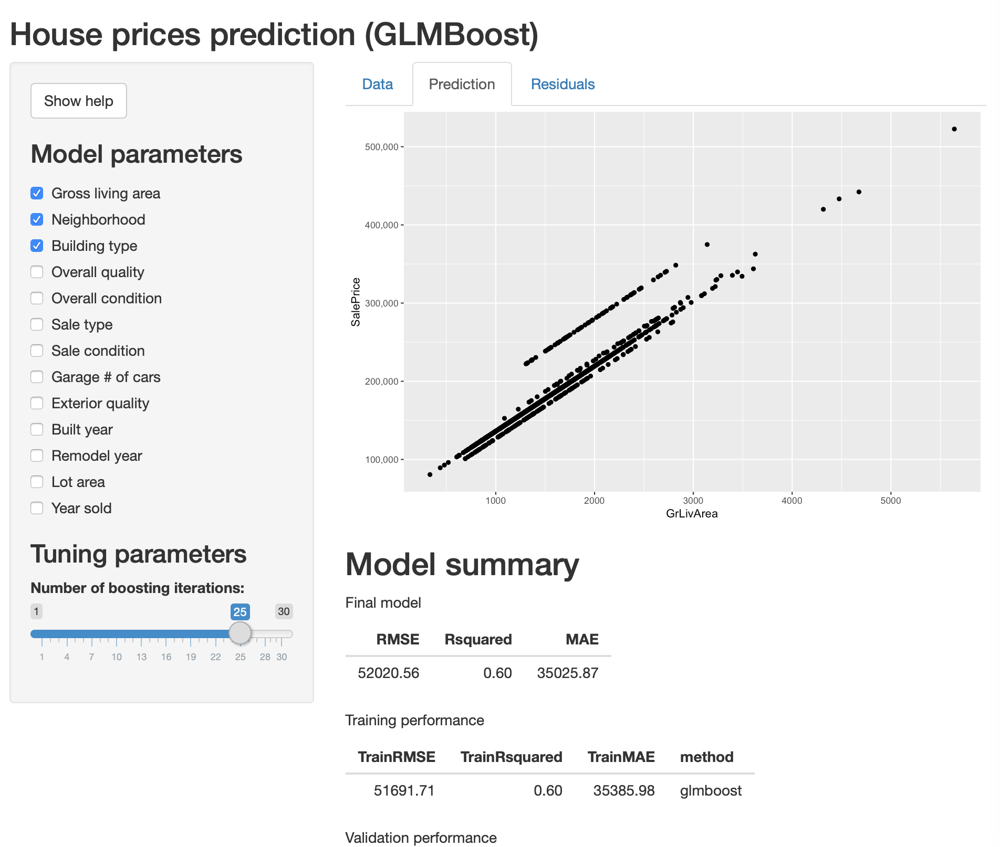

```{r setup, include=FALSE}
library(ggplot2)
library(scales)

knitr::opts_chunk$set(echo = FALSE)

file_name <- "house_prices.csv"
if (!file.exists(file_name)) {
  unzip(paste0(file_name, ".zip"))
}
house_df <- read.csv(file_name)
```

## Idea

Machine learning algorithms are often tricky to tune. This application lets you doodle around interactively and build a boosted GLM model.

It'll show you exactly what the model predictions look like, and you can quickly add variables or set tuning parameters for the model. Every time you make a change, the model is quickly rebuilt and performance metrics are recalculated.

## Example dataset

The app uses the [Kaggle House Prices dataset](https://www.kaggle.com/c/house-prices-advanced-regression-techniques). There are `r nrow(house_df)` entries in the dataset between years `r min(house_df$YrSold)` and `r max(house_df$YrSold)`.

```{r, echo = TRUE, fig.height=4}
ggplot(house_df, aes(x = GrLivArea, y = SalePrice)) + geom_point() +
  scale_y_continuous(labels = comma)
```

## App UI

```{r, out.width = "600px"}

```


## Usage

The left pane allows you to select model variables and adjust tuning parameters. Once any selections are made, a GLMBoost model is automatically rebuilt and model performance is calculated.

Performance metrics will appear automatically, and tab controls let you see predicted house prices for the entire dataset or residual values against actual sales prices.